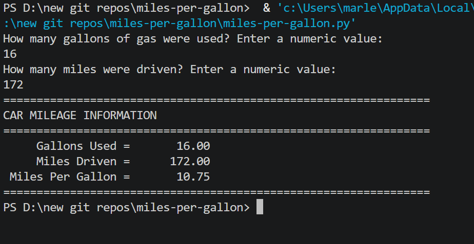

# ⛽ Miles Per Gallon Calculator

A Python console application that calculates a vehicle's fuel efficiency in miles per gallon (MPG) and displays a clean formatted report.

---

## Features

- Accepts gallons used and miles driven as input
- Calculates MPG using the formula: `miles ÷ gallons`
- Displays right-aligned formatted output
- Input validation — catches non-numeric entries and division by zero

---

## How It Works

1. User enters gallons of gas used (decimal values accepted)
2. User enters miles driven
3. Program divides miles by gallons to calculate MPG
4. Results are printed in a formatted table

---

## Example Output

```
How many gallons of gas were used? Enter a numeric value:
10
How many miles were driven? Enter a numeric value:
320
================================================================
CAR MILEAGE INFORMATION
================================================================
     Gallons Used =       10.00
     Miles Driven =      320.00
 Miles Per Gallon =       32.00
================================================================
```

---

## Screenshot



---

## Technologies Used

- Python 3
- Built-in `format()` function for column-aligned output
- `try/except` for input validation
- `while` loop for re-prompting on bad input

---

## Learning Outcomes

- Variables and data types (`float`)
- Arithmetic: division
- String formatting with `format()` and f-strings
- Input validation and error handling
- Guard clauses (division by zero)

---

## How to Run

1. Make sure Python 3 is installed: https://www.python.org/downloads/
2. Clone or download this repo
3. Open a terminal in the repo folder
4. Run: `python miles_per_gallon.py`
5. Follow the prompts

---

## Folder Structure

```
miles-per-gallon-calculator/
├── miles_per_gallon.py
├── output.png
├── README.md
├── LICENSE
└── .gitignore
```

---

## License

This project is licensed under the MIT License — see the [LICENSE](LICENSE) file for details.

---

*Written by Marlena Fabrick — Computer Programming, Fall 2020*


